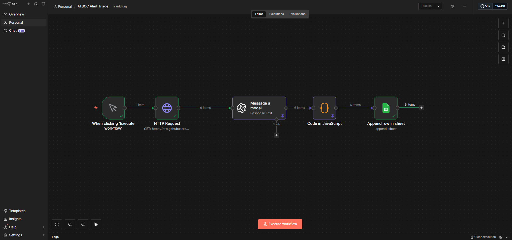
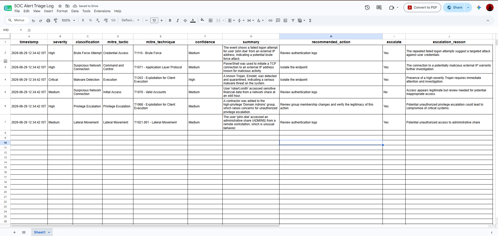
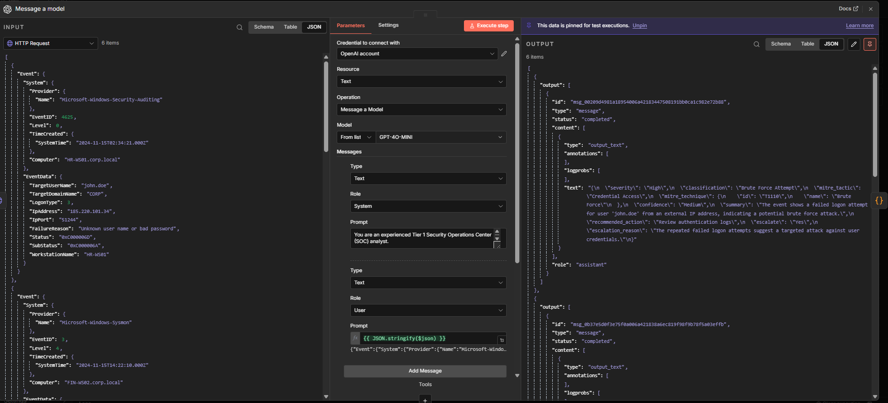

# AI-Powered SOC Alert Triage Assistant

An AI-assisted Security Operations Center (SOC) alert triage workflow built with n8n and GPT-4o mini.

The workflow ingests Windows Security Event and Sysmon telemetry in JSON format, performs automated L1 SOC triage, maps alerts to the MITRE ATT&CK framework, and logs structured analyst decisions to Google Sheets.

---

## Features

- AI-assisted alert triage
- Severity classification
- MITRE ATT&CK tactic & technique mapping
- Recommended response actions
- Escalation decisions
- Batch processing of multiple alerts
- Google Sheets incident logging

---

## Architecture

```
GitHub (alerts.json)
        │
        ▼
HTTP Request
        │
        ▼
GPT-4o mini
        │
        ▼
Code Node
(JSON Parsing)
        │
        ▼
Google Sheets
```


---

# Sample Output



---

# AI Analysis


---

## Technologies

- n8n
- OpenAI GPT-4o mini
- GitHub
- Google Sheets
- JSON
- Windows Security Events
- Sysmon
- MITRE ATT&CK

---

## Sample Alerts

The project includes realistic Windows and Sysmon security events including:

- Windows Event ID 4625 – Failed Logon
- Sysmon Event ID 3 – Network Connection
- Windows Defender Event ID 1116 – Malware Detection
- Windows Event ID 4663 – Object Access
- Windows Event ID 4728 – Privilege Escalation
- Windows Event ID 5140 – Network Share Access

---

## Example Output

| Severity | Classification | MITRE | Escalate |
|----------|----------------|--------|-----------|
| High | Brute Force Attempt | T1110 | Yes |
| High | Suspicious Network Connection | T1071 | Yes |
| Critical | Malware Detection | T1203 | Yes |
| Medium | Off-Hours Access | T1078 | No |
| High | Privilege Escalation | T1068 | Yes |
| Medium | Lateral Movement | T1021 | Yes |

---

## Repository Structure

```
sample_alerts/
workflow/
screenshots/
README.md
```

---

## Future Improvements

- Support additional Windows Event IDs
- Integrate with SIEM platforms such as Splunk and Microsoft Sentinel
- Store incidents in a database instead of Google Sheets
- Support real-time webhook ingestion
- Confidence scoring using historical context

---

## Disclaimer

This project is intended for educational and portfolio purposes. AI-generated classifications are designed to assist SOC analysts and should not replace human investigation.
